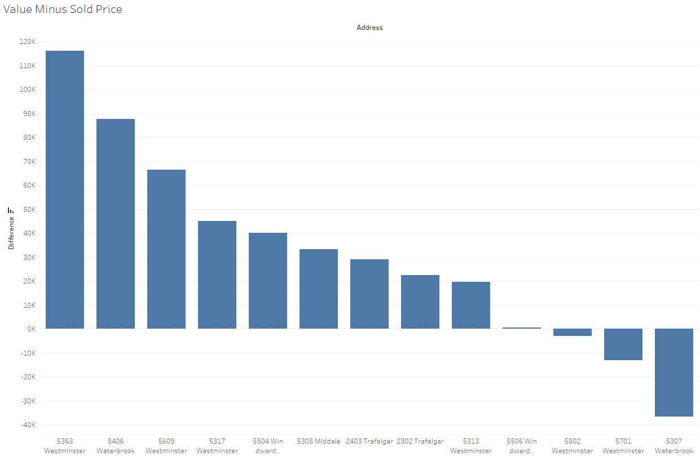

The property at 5363 Westminster has been inequitably appraised and should be valued at $462,614 based on comparable homes in the area. 

There are 12 comparable properties sold in the past 18 months within 0.5 miles of the property. These homes in the neighborhood range in value from $357,604 to $486,897, and ranged in sold price from $270,000 to $500,000. Of all the properties, 5363 Westminster is valued the highest and has the highest difference in value compared to sold price. 5506 Windward has the closest value to its sold price with a price per square foot (PPSF) at $175.30. This number happens to be closest to the average PPSF of the area of $173.03. Using the average PPSF to compute 5363’s value, the home should be valued at $462,614 instead of the original number of $516,905. 

As well, 5363 was refinanced in 2020 and given an appraised value of $406,000, meaning that the value could be lower than this analysis shows. 

The chart below shows the difference in value from the sold price of the home. 

This chart shows the price per square foot of all the properties analyzed including 5363. 

